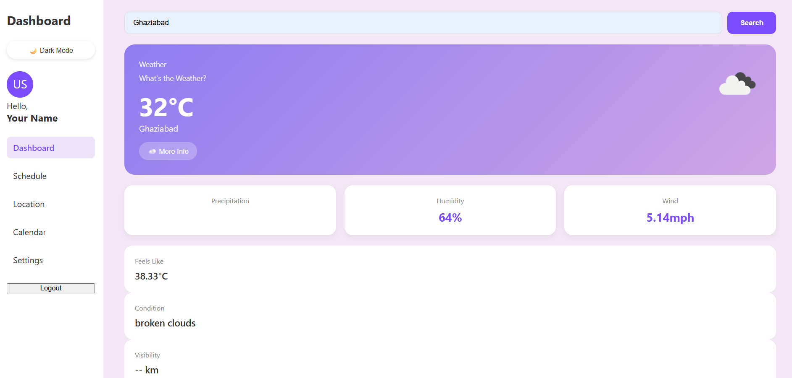

# 🌤️ Weather Web Dashboard

A responsive weather dashboard that lets users search for any city and view real-time weather information using the OpenWeatherMap API. Built as a hands-on project to learn frontend fundamentals — API integration, DOM manipulation, responsive design, error handling, and browser storage.

🔗 **Live Demo:** https://avani1606.github.io/weather-dashboard/

## 🛠️ Tech Stack

- HTML5 – Structure
- CSS3 – Styling, responsive design, CSS variables/theming
- JavaScript (ES6) – Functionality, async/await, localStorage
- Fetch API – API requests
- OpenWeatherMap API – Weather data
- Git & GitHub – Version control
- GitHub Pages – Deployment

## ✨ Features

**Core**
- Search weather by city name
- Displays temperature, feels-like, condition, humidity, wind speed, visibility
- Weather icon based on current conditions
- Loading indicator during API calls
- Error handling for invalid city searches
- Fully responsive design (mobile, tablet, desktop)

**Bonus (built beyond original scope)**
- "More Info" popup showing sunrise, sunset, and min/max temperature
- Dark / Light mode toggle with CSS variables
- Theme preference saved via localStorage (persists across page reloads)

## 🚀 Planned Enhancements

- Current location weather (Geolocation)
- 5-day weather forecast
- Recent searches (Local Storage)
- Favorite cities

## 📸 Screenshot

## 🏃 Running Locally

1. Clone this repo: